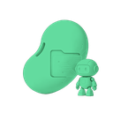
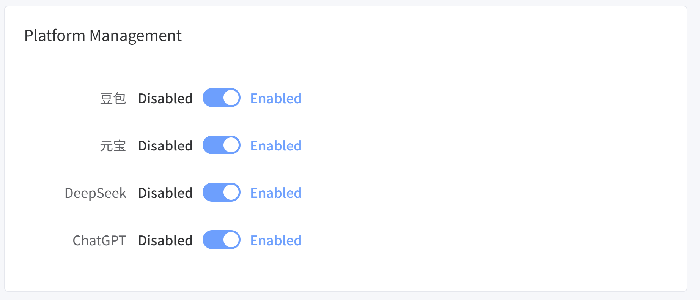
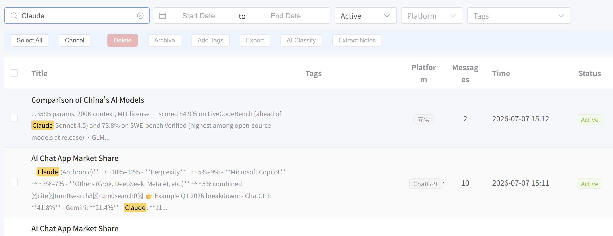
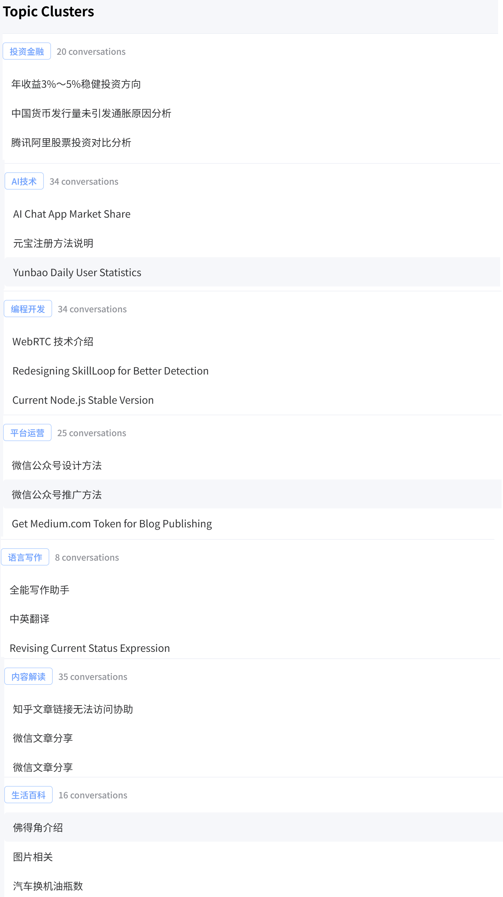
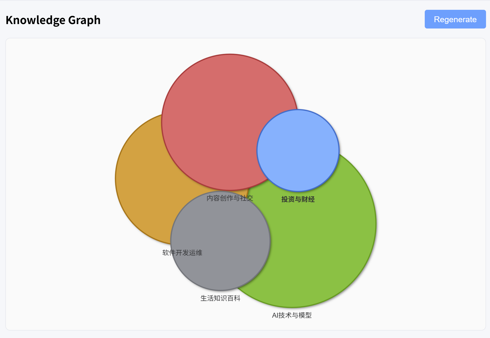
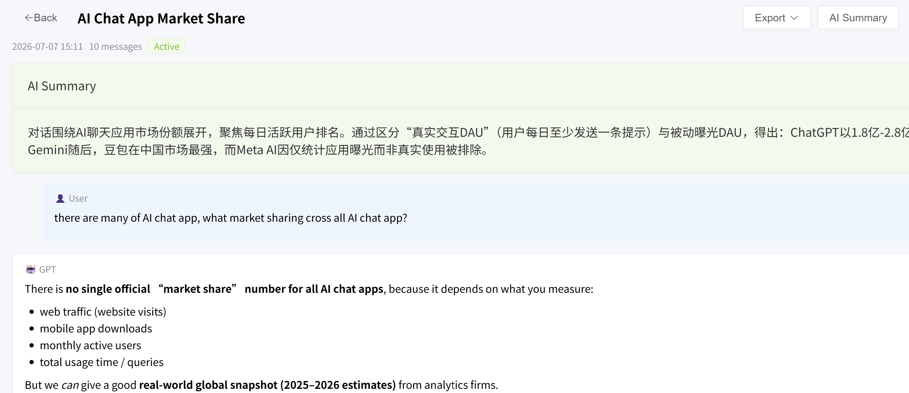
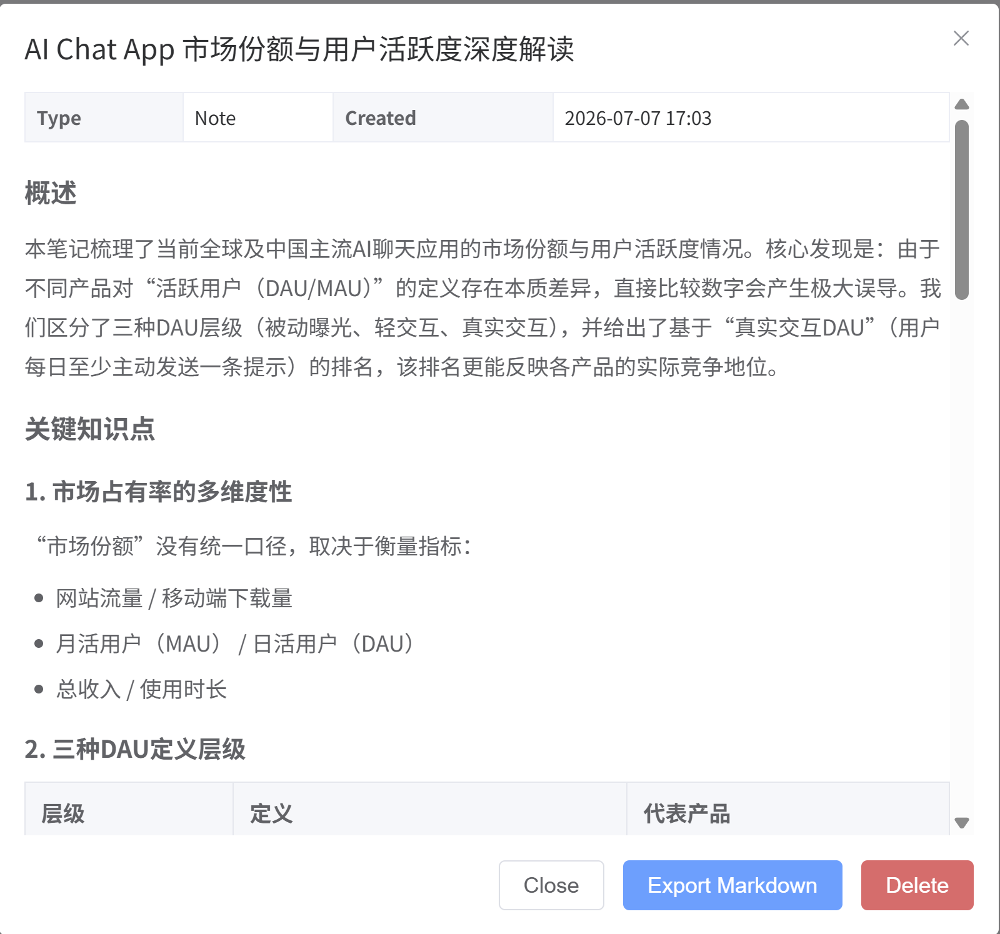

# DouXia — Own Your AI Conversations

**Stop losing valuable insights in hundreds of AI conversations. Take control of your knowledge assets.**

[Download](#download) · [Features](#key-features) · [Privacy](#privacy--data)

---

## Why DouXia?

You ask AI assistants dozens of questions every day — coding problems, research deep-dives, writing drafts, life advice. Over months, you've built up hundreds of valuable conversations across Doubao, Yuanbao, DeepSeek, ChatGPT, and others.

But here's the problem: **all that knowledge is trapped**.

- You remember asking about something last month, but good luck scrolling through hundreds of chats to find it
- You can't export your conversations in bulk — no platform lets you
- You can't organize them — conversations pile up in a single timeline with no way to tag, group, or prioritize
- You can't clean up — deleting outdated chats one by one across multiple platforms? Nobody has time for that
- You can't reuse insights — when you need to reference an answer, you're stuck copy-pasting line by line

**The more you use AI, the worse this gets.** Your best insights are scattered across platforms you don't control.

DouXia (豆匣) solves this. It's a local-first desktop app that embeds your AI platforms inside a native window, quietly captures every conversation, and stores them on your own computer — so you can find, organize, and reuse your knowledge instantly.



---

## Supported Platforms

| Platform | Capture | Sync Delete | Status |
|----------|---------|-------------|--------|
| Doubao (豆包) | ✅ | ✅ Permanent | Available |
| Yuanbao (元宝) | ✅ | ✅ Permanent | Available |
| DeepSeek | ✅ | ✅ Permanent | Available |
| ChatGPT | ✅ | ✅ Permanent | Available |

---

## How It Works

```
┌───────────────────────────────────────────────────┐
│                  DouXia Desktop App                │
│                                                   │
│  ┌────────┐ ┌────────┐ ┌────────┐ ┌────────┐    │
│  │ Doubao │ │Yuanbao │ │DeepSeek│ │ChatGPT │    │
│  │Embedded│ │Embedded│ │Embedded│ │Embedded│    │
│  └───┬────┘ └───┬────┘ └───┬────┘ └───┬────┘    │
│      └──────────┴──────────┴──────────┘          │
│                        │                          │
│                 ┌──────▼──────┐                   │
│                 │ Auto-Capture│                   │
│                 │   & Store   │                   │
│                 └──────┬──────┘                   │
│                        │                          │
│      ┌─────────────────┼─────────────────┐        │
│      │                 │                 │        │
│   ┌──▼──┐        ┌────▼───┐       ┌─────▼──┐    │
│   │Search│        │Organize│       │ Export │    │
│   │(FTS) │        │(Tags,  │       │(MD,    │    │
│   │      │        │Cluster)│       │PDF)    │    │
│   └──────┘        └────────┘       └────────┘    │
│                                                   │
│         All data stored locally in SQLite         │
└───────────────────────────────────────────────────┘
```

---

## Key Features

### 1. Auto-Capture — Never Lose a Conversation

Use Doubao, Yuanbao, DeepSeek, or ChatGPT directly inside DouXia — the experience is identical to using them in your browser. Every conversation is automatically captured and stored in your local database in real time. No manual copying, no extra steps.

### 2. Unified Search & Browse

Browse, search, and filter all your AI conversations in one place — regardless of which platform they came from. Full-text search (FTS5) finds answers buried deep in long conversations. Filter by date range, platform, status, or tags.



### 3. Smart Organization

- **AI Auto-Tagging** — One click to analyze and tag conversations by topic
- **Topic Clustering** — Automatically group related conversations together
- **Knowledge Graph** — Visualize how your topics and ideas connect
- **Tag Management** — Create custom tags with colors; browse by tag





### 4. AI-Powered Knowledge Extraction

Turn fragmented Q&A sessions into structured knowledge:

- **AI Summary** — Generate a concise summary of any conversation
- **Knowledge Cards** — Extract structured notes from one or multiple conversations
- **Smart Cleanup** — AI recommends which conversations are outdated or low-value, so you can clean up in bulk





### 5. Flexible Export & Sharing

- Export individual conversations or entire collections as **Markdown**, **HTML**, or **PDF**
- Set a default export folder for one-click export
- **LAN sharing** — other devices on your local network can browse your knowledge base via browser
- Database backup and restore

### 6. Chinese & English

Full bilingual interface — switch between Chinese and English seamlessly.

---

## Before & After

| Before DouXia | After DouXia |
|---|---|
| Hours spent scrolling through hundreds of chats to find one answer | **Instant search** — find any conversation in seconds |
| Manual copy-paste, line by line | **One-click export** to Markdown, HTML, or PDF |
| Outdated conversations cluttering your workspace | **Smart cleanup** — AI recommends what to delete, bulk action |
| Knowledge scattered across 3-4 platforms | **Unified view** — all conversations in one place |
| No way to organize or tag conversations | **AI auto-tagging** and topic clustering |
| Can't reuse insights from past conversations | **Knowledge cards** and summaries extract real value |

**The real value:** You stop losing knowledge. You start building a searchable, organized knowledge base from your AI conversations — without any extra effort.

---

## Download

| Platform | Download | Size | Requirements |
|----------|----------|------|--------------|
| Windows (x64) | [DouXia-Setup-x.x.x.exe](https://github.com/KylinLabAI/DouXia-App/releases/latest) | ~113 MB | Windows 10+ |
| macOS (Apple Silicon) | [DouXia-x.x.x-arm64.dmg](https://github.com/KylinLabAI/DouXia-App/releases/latest) | ~136 MB | macOS 11+ (M1/M2/M3/M4) |
| macOS (Intel) | [DouXia-x.x.x-x64.dmg](https://github.com/KylinLabAI/DouXia-App/releases/latest) | ~141 MB | macOS 11+ (Intel) |

> See [all releases](https://github.com/KylinLabAI/DouXia-App/releases)

---

## Quick Start

1. Download the installer for your platform
2. Install and launch DouXia
3. Log into your AI platforms inside the app
4. Start chatting — conversations are captured automatically
5. Switch to the Knowledge tab to search, organize, and export

---

## Privacy & Data

- **Your data stays on your device** — All conversations are stored locally in SQLite. Nothing is uploaded to any server, ever.
- **No account required** — DouXia works out of the box. No sign-up, no cloud sync, no tracking.
- **You control the AI** — Smart features (tagging, summaries, clustering) use your own API key. You decide which AI provider to use and when.
- **Works offline** — Core features (search, browse, export, organize) work without internet. You only need a connection when chatting with AI platforms.

---

## Links

- [Report an Issue](https://github.com/KylinLabAI/DouXia-App/issues)
- [Release Notes](https://github.com/KylinLabAI/DouXia-App/releases)
